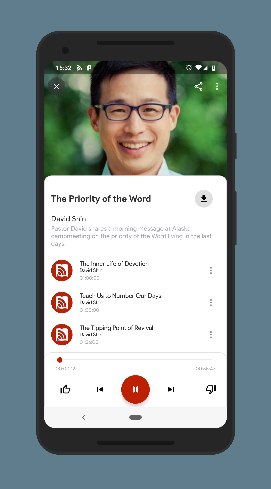

# audioverse-android
Android client app browsing the [AudioVerse](https://www.audioverse.org/) API

## Screenshots 

This is not an official AudioVerse app, official source can be found [here](https://github.com/AVORG/audioverse-mobile) 

## Building the source
1. Latest version of Android studio
2. Contact [AudioVerse](https://github.com/AVORG/audioverse-mobile/blob/master/README.md) technical team to get an api `BASE_URL` and `API_TOKEN`
### You just want an apk?
Get the latest release version [here](app/release/app-release.apk)

## Playback
This app doesn't have playback functionality yet but will allow you to stream the sermons via other music player apps like [Play Music](https://play.google.com/store/apps/details?id=com.google.android.music) or [VLC](https://play.google.com/store/apps/details?id=org.videolan.vlc)

## Technologies used
* Kotlin
* Retrofit
* Android Architecture Components 
* Dagger

## License

    Copyright 2018 Tinashe Mzondiwa

    Licensed under the Apache License, Version 2.0 (the "License");
    you may not use this file except in compliance with the License.
    You may obtain a copy of the License at

       http://www.apache.org/licenses/LICENSE-2.0

    Unless required by applicable law or agreed to in writing, software
    distributed under the License is distributed on an "AS IS" BASIS,
    WITHOUT WARRANTIES OR CONDITIONS OF ANY KIND, either express or implied.
    See the License for the specific language governing permissions and
    limitations under the License.
